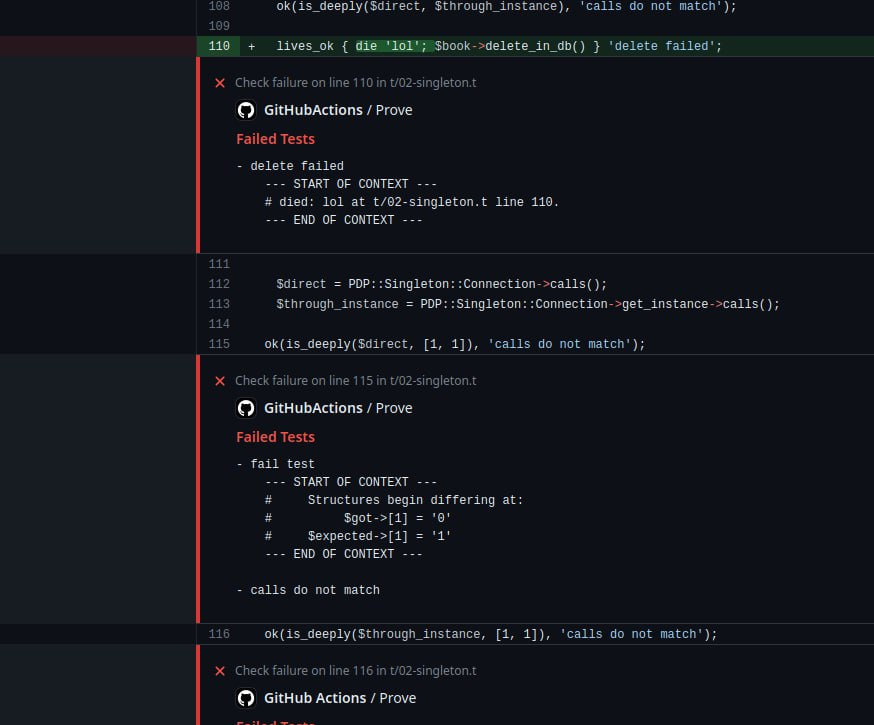

TAP-Formatter-GitHubActions version 0.01
========================================

Provide a Formatter for TAP::Harness that outputs Error messages for
[GitHub Actions (GHA)][0].

It's very alpha but does the best to grab out of the comments provided in the
TAP verbose output the file & line and any extra context to print in the
GHA annotations.

It converts TAP output like:
```
#   Failed test 'failure name 2'
#   at t/02-singleton.t line 16.
#          got: '3'
#     expected: '4'
```

To:

```
# ::error file=t/fixtures/tests/all-mixed,line=16,title=Failed Tests::- failure name 2%0A--- CAPTURED CONTEXT ---%0A    #          got: '3'%0A    #     expected: '4'%0A---  END OF CONTEXT  ---
```

And those annotations render in PR's like so: (not a 1:1 example yet.)


INSTALLATION
------------
To install this module type the following:

```bash
perl Makefile.PL
make
make test
make install
```

DEPENDENCIES
------------
This module requires these other modules and libraries:

  - `TAP::Harness`

COPYRIGHT AND LICENCE
---------------------
Put the correct copyright and licence information here.

Copyright (C) 2023 by Jose D. Gómez R.

This library is free software; you can redistribute it and/or modify
it under the same terms as Perl itself, either Perl version 5.38.0 or,
at your option, any later version of Perl 5 you may have available.


[0]: https://docs.github.com/en/actions/using-workflows/workflow-commands-for-github-actions#setting-an-error-message